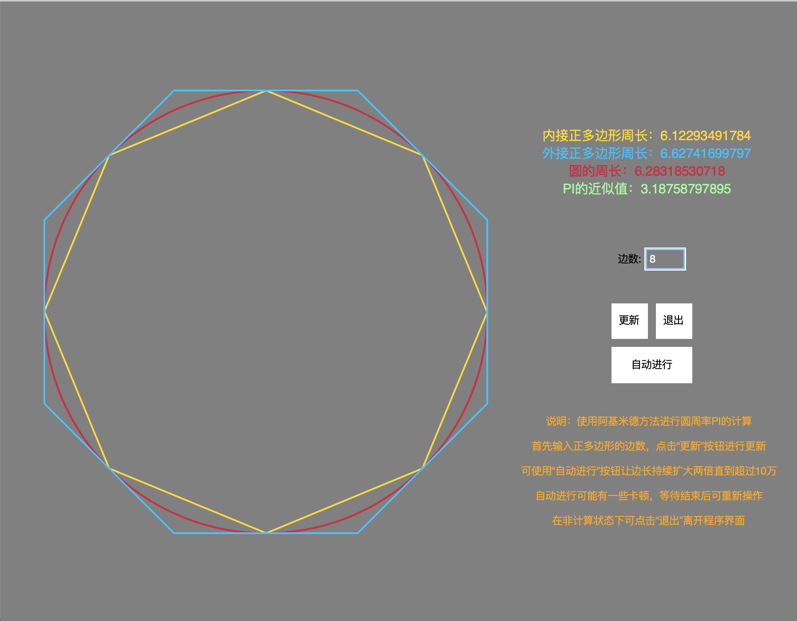

# cutting_the_circle
 Python code to demostrate Archimedes' way to calculate PI

 This is the project for *Mathematical Algorithm in Traditional Chinese Culture*. It's a simple demo of Archimedes' way to calculate PI.

 

 
